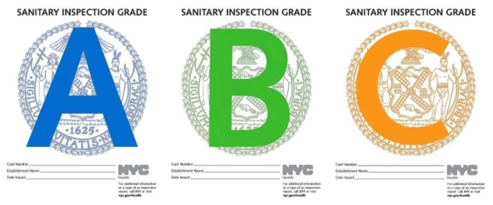

<style type="text/css">

h1.title {
  text-align: center;
}
h3.subtitle {
  text-align: center;
}
h4.author { 
  text-align: center;
}
</style>

<br>
<center></center>

## 1. Introduction

**Since July 2010, the Health Department has required restaurants to implement letter grading showing the sanitary inspection results. The Health Department inspects about 24,000 restaurants a year to monitor compliance with City and State food safety regulations. This dataset is called New York Restaurant Inspection Result which contains the detailed information of each restaurant inspected like name, location, phone number and the result of each inspection including score, grade, violation description and so on. We found this dataset from NYC OpenData website and we would like to look into the dataset and to find some patterns with its geographic data, and times series data, etc. The link to the website is: <https://data.cityofnewyork.us/Health/DOHMH-New-York-City-Restaurant-Inspection-Results/43nn-pn8j>.**

**Restaurants with a score between 0 and 13 points earn an A, those with 14 to 27 points receive a B and those with 28 or more a C. Inspection results are posted on the Health Department’s website.**

**According to their website, a restaurant’s score depends on how well it follows City and State food safety requirements. Inspectors check for food handling, food temperature, personal hygiene, facility and equipment maintenance and vermin control. Each violation earns a certain number of points. At the end of the inspection, the inspector totals the points and this number is the restaurant’s inspection score; the lower the score, the better. The points are given depends on a violation they have to the public and the violations fall into three categories:**

**a. A public health hazard, such as failing to keep food at the right temperature, triggers a minimum of 7 points. If the violation can’t be corrected before the inspection ends, the Health Department may close the restaurant until it’s fixed. **

**b. A critical violation, for example, serving raw food such as a salad without properly washing it first, carries a minimum of 5 points. **

**c. A general violation, such as not properly sanitizing cooking utensils, receives at least 2 points.**

**Inspectors assign additional points to reflect the extent of the violation. A violation’s condition level can range from 1 (least extensive) to 5 (most extensive). For example, the presence of one contaminated food item is a condition level 1 violation, generating 7 points. Four or more contaminated food items is a condition level 4 violation, resulting in 10 points.**

**Two types of inspections result in a letter grade: initial inspections for which the restaurant earns an A and re- inspections that result in an A, B or C. A restaurant has two chances to earn an A in every inspection cycle. If it doesn’t earn an A on the first inspection, it’s scored but ungraded. An inspector goes back to the restaurant unannounced, typically within a month, to inspect it again and the re-inspection is graded. If the grade is a B or C, the restaurant will receive a grade card and a grade pending card. It can post either card until it has an opportunity to be heard at the Office of Administrative Trials and Hearings Health Tribunal. Until a restaurant has a graded inspection, it is listed as Not Yet Graded on the Health Department website.**

<center></center>

## 2. Team

**The team members are: Dong Hyeun Kim (dk2601) and Chengcheng Yuan (cy2434).**

**We contributed equally for our project and worked together for every stage from gathering and cleaning the data to analyzing the data and writing final report.**

## 3. Analysis of Data Quality

```{r, message=FALSE, warning=FALSE}
library(ggplot2)
library(dplyr)
library(zoo)
library(scales)
library(lubridate)
library(extracat)
library(viridis)
library(stringr)
library(choroplethrZip)
# import the data
df <- read.csv("NYrestaurants.csv",  na.strings = c(" ","", "N/A","missing"), header = T, as.is = T)
```


```{r}
# plot of NA values
df_na <- df
colnames(df_na)[8] <- "CUISINE.DESC"
colnames(df_na)[9] <- "INSP.DATE"
colnames(df_na)[11] <- "VI.CODE"
colnames(df_na)[12] <- "VI.DESC"
colnames(df_na)[18] <- "INSP.TYPE"
```

<center> <font size="5">Missing Data Pattern</font> </center>
<br>
```{r, echo=FALSE, fig.align='center'}
visna(df_na, sort="b",mar.col = c(alpha("black", 1)) ,  s = 0.5, pmax = 0.5 )
```

<br><br>
<center> <font size="5">Missing Data Pattern with Initial Inspections of Score 14 or Higher</font> </center>
<br>
```{r, echo=FALSE, fig.align='center'}
df_na1 <- df_na %>% filter(INSP.TYPE == c("Cycle Inspection / Initial Inspection") & SCORE >14)
visna(df_na1)
```

**We clearly can see the missing pattern that ‘GRADE’ and ‘GRADE.DATE’ are missing in the same time. This is because the restaurant is inspected although it is not graded at the date of the inspection. There are reasons why inspections are not graded. The following are scored but not graded.**

**a. Initial inspections that result in a score of 14 points or higher (in this case, the restaurant will be re-inspected later and will not be graded; you can see the graph above that all grades are missing in this case) **

**b. Monitoring inspections at a restaurant that has performed very poorly on its re-inspection. The Health Department may continue to inspect the restaurant roughly once a month until it scores below 28 or the Department closes it for serious and persistent violations. **

**c. Inspections at new restaurants not yet open to the public**

**d. An inspection at a restaurant seeking to reopen after the Department closed it  **

**e. Some inspections in response to complaints **

**There are also gradable inspection and non-gradable inspections according to the Health department. Inspections are gradable if the following statements are true:**

**a. INSPECTION TYPE in (Cycle Inspection/Initial Inspection, Cycle Inspection/Re-Inspection, Pre-Permit (Operational)/Initial Inspection, Pre-Permit (Operational)/Re-Inspection) **

**b. ACTION in (Violations were cited in the following area(s), No violations were recorded at the time of this inspection, Establishment Closed by DOHMH)**

**c. INSPECTION DATE > July 26, 2010**

**Non-gradable inspections are performed to enforce special programs, such as the Smoke Free Act and trans fat rules, or they may be performed for other reasons, such as when the restaurant is ready to reopen after a closing. Some of these inspections are conducted when the restaurant has not yet started or resumed operations, and these non-operational inspections tends to receive lower scores since the restaurant is not in operation during the inspection. Special Program and Administrative violations (including violation codes 15 - 22) do not contribute towards SCORE and do not contribute towards determining GRADE. Compliance inspections are scored but do not contribute towards determining GRADE.**

**Since there are appropriate reasons stated above for why some grade are missing and the amount of data is pretty large in our dataset, then we will choose to remove those missing values when performing our analysis below.**

## 4. Exploratory Data Analysis

### 4.1. Analysis of Grade variable

**The values of variable grade include: A, B, C, P, Z and not yet graded. Since the P, Z and not yet graded only take up a small part of the data and it may refer to some unusual situation. Therefore, in our analysis, we mainly take a look at the value A, B and C and will want to know the relationship between grade and other variables, like borough and cuisine type.**

#### 4.1.1 Relationship between Grade and Borough
```{r, fig.align = 'center', fig.width = 8}
# data clearning for some format
df <- within(df, {CUISINE.DESCRIPTION[CUISINE.DESCRIPTION == "Latin (Cuban, Dominican, Puerto Rican, South & Central American)"] <- "Latin"
CUISINE.DESCRIPTION[CUISINE.DESCRIPTION == "Latin (Cuban, Dominican, Puerto Rican, South & Central American)"] <- "Latin"
CUISINE.DESCRIPTION[CUISINE.DESCRIPTION == "Café/Coffee/Tea"] <- "Coffee/Tea"
CUISINE.DESCRIPTION[CUISINE.DESCRIPTION == "Italian"] <- "Pizza/Italian"
CUISINE.DESCRIPTION[CUISINE.DESCRIPTION == "Pizza"] <- "Pizza/Italian"
CUISINE.DESCRIPTION[CUISINE.DESCRIPTION == "Sandwiches"] <- "Sandwiches/Salads/Mixed Buffet"
BORO <- str_to_title(BORO)
}
)
df <- df %>% mutate(Date = as.Date(INSPECTION.DATE, format = "%m/%d/%Y"))

# select data for unique restaurant with grade A, B and C 
df_grade_critical <- filter(df, GRADE %in% c("A", "B", "C") & BORO != "Missing")
df_grade <- unique(df_grade_critical[c("CAMIS", "DBA", "BORO", "CUISINE.DESCRIPTION", "Date", "SCORE", "GRADE")])
df_grade$BORO <- factor(df_grade$BORO, levels = names(sort(table(df_grade$BORO), decreasing=TRUE)))

# bar plot
ggplot(df_grade, aes(x = BORO, fill = GRADE)) + 
  geom_bar(position = "dodge") + 
  labs( y = "Number", x = "Borough", fill = "Grade") +
  ggtitle("New York Restaurant Grade for Different Boroughs") +
  theme_grey(16) +
  theme(plot.title = element_text(hjust = 0.5)) +
  scale_color_viridis()
```

**From the bar plot, we could see that among the restaurants to be graded as A, B and C in New York, the number in Manhattan is the most and the number in Staten Island is the least. For every borough, the number of restaurants to be graded A is much more than those to be graded B and the number of grade B is also greater than C. Therefore we could know that the overall condition of New York restaurants is good since the majority of the restaurants will get an A.**

```{r, fig.align = 'center', fig.width = 8}
# bar plot for percentage of grade 
ggplot(df_grade, aes(x = BORO, fill = GRADE)) + 
  geom_bar(position = "fill", width = 0.7) +
  scale_y_continuous(labels = percent_format()) +
  labs( y = "Percentage", x = "Borough", fill = "Grade") +
  ggtitle("Percentage of Grade for Different Boroughs") +
  theme_grey(16) +
  theme(plot.title = element_text(hjust = 0.5)) +
  scale_color_viridis()
```

**After taking a look at the percentage of each Grade for different boroughs, we could see that the proportion of A, B and C for different boroughs are nearly the same except that Bronx had a slightly lower percentage of grade A. Therefore we could conclude that seeing from the distribution of grade, the environment of restaurants from different boroughs are comparable.**

#### 4.1.2 Relationship between Grade and Cuisine Type

**The variable Cuisine Description in the data include 85 categories and some of them are not very common, so we will mainly focus our analysis on the top 30 cuisine types according to the number of data we have in the dataset. First, we will want to take a look at what these 30 cuisine types are and how popular are they in New York City.**

```{r, fig.align = 'left', fig.width = 12, fig.height=8}
# select top 30 cuisine type
cuisine_list <- names(sort(table(df_grade$CUISINE.DESCRIPTION), decreasing = T)[1:30])
df_cuisine <- filter(df_grade, CUISINE.DESCRIPTION %in% cuisine_list)

df_cuisine$CUISINE.DESCRIPTION <- factor(df_cuisine$CUISINE.DESCRIPTION, levels = names(sort(table(df_cuisine$CUISINE.DESCRIPTION))))

# bar plot for cuisine type
ggplot(df_cuisine, aes(x = CUISINE.DESCRIPTION)) + 
  geom_bar(position = "dodge", fill = "grey30")+
  coord_flip() + 
  labs( y = "Number", x = "Cuisine Type") +
  ggtitle("Number of Restaurant for Different Cuisine Types") +
  theme_grey(16) +
  theme(plot.title = element_text(hjust = 0)) +
  scale_color_viridis()
```

**Above is the bar plot of the top 30 cuisine types in New York. We could see that as we might have expected, the American cuisine is the most popular in New York, followed by Italian/Pizza, Chinese, Coffee/Tea and so on. The result is reasonable. And then we will find out the relationship between grade and cuisine type.**

```{r, fig.align = 'left', fig.width = 12, fig.height = 8}
# order the cuisine type according to the percentage of grade A
cuisine_grade <- df_cuisine %>% group_by(CUISINE.DESCRIPTION) %>% summarize(count = n(), grade_A = sum(GRADE == "A"))
cuisine_grade <- within(cuisine_grade, percent <- grade_A/count)
df_cuisine$CUISINE.DESCRIPTION <- factor(df_cuisine$CUISINE.DESCRIPTION, levels = cuisine_grade$CUISINE.DESCRIPTION[order(cuisine_grade$percent)])

# bar plot for percentage of grade
ggplot(df_cuisine, aes(x = CUISINE.DESCRIPTION, fill = GRADE)) + 
  geom_bar(position = "fill", width = 0.7) +
  scale_y_continuous(labels = percent_format())+
  coord_flip() +
  labs( y = "Percentage", x = "Cuisine Type", fill = "Grade") +
  ggtitle("Percentage of Grade for Different Cuisine Types") +
  theme_grey(16) +
  theme(plot.title = element_text(hjust = 0)) +
  scale_color_viridis()
```

**We draw a plot to display the percentage of Grade A, B and C for each cuisine type and order them by the percentage of grade A from highest to lowest. We could easily see that Coffee/Tea got the highest percentage of grade A, followed by Donuts, Ice cream, Gelato, Yogurt, Ices, Hamburgers and so on. The several cuisine types at the bottom are Korean, Asian, Spanish and Latin which got the lowest percentage of grade A. The result could somewhat in accordance with our intuition that the condition of the restaurant is kind of related to the cooking methods of the cuisine type it serves.**

#### 4.1.3 Relationship between Grade and Critical Flag
```{r, fig.align = 'center'}
# bar plot for critical flag
ggplot(filter(df_grade_critical, CRITICAL.FLAG != "Not Applicable") ,aes(x = GRADE, fill = CRITICAL.FLAG)) + 
  geom_bar(position = "fill", width = 0.7)+
  scale_y_continuous(labels = percent_format()) +
  labs( y = "Percentage", x = "Grade", fill = "Critical Flag") +
  ggtitle("Percentage of Critical Flag for Each Grade") +
  theme_grey(16) +
  theme(plot.title = element_text(hjust = 0)) +
  scale_color_viridis()
```

**There are three kinds of critical flag which are “Not Critical”, “Critical”, and “Not Applicable”. “Critical” flagged violations are those most likely to contribute to foodborne illness which higher violation points are given to the restaurants. Therefore, “A” graded restaurants receive less “Critical” flagged violations and it also means they have higher hygiene level based on the rules from the DOH.**

#### 4.1.4 Change of percentage of Grade over time from 2014 to 2017

**Since we have the inspection date variable in our dataset, we could also draw a time series plot to see the change of percentage of Grade A, B and C over time. Also, if we draw the plot by day, then there will be some missing data for Saturday and Sunday and there are also some date that only have a few observations in the dataset, which may not be very convincing. Therefore, we would like to consider the percentage of grade on a month level and the plot is the following.**

```{r, fig.align = 'center', fig.width = 8}
# prepare data for time series plot
df_grade$Time <- as.Date(as.yearmon(df_grade$Date))
df_grade_time <- df_grade %>% group_by(Time, GRADE) %>% summarize(Count = n()) %>% subset(Time >= "2014-01-01" & Time < "2017-10-01")
df_grade_sum <- df_grade_time %>% group_by(Time) %>% summarize(Sum = sum(Count))
df_grade_time$Sum <- rep(df_grade_sum$Sum, each = 3)
df_grade_time <- within(df_grade_time, Percentage <- Count/Sum)

# time series plot for percentage of grade
ggplot(df_grade_time, aes(Time, Percentage, color = GRADE)) + 
  geom_point() +
  geom_line() +
  scale_x_date(breaks = seq(min(df_grade_time$Time),max(df_grade_time$Time),by="6 months"),date_labels = "%b %y") +
  labs( y = "Percentage", x = "", color = "Grade") +
  ggtitle("Percentage of Grade for Every Month") +
  theme_grey(16) +
  theme(plot.title = element_text(hjust = 0.5)) 
```

**From the percentage of grade for every month from 2014 to 2017, we could see that the percentage of grade A increased a little bit since July, 2016 and the the percentage of grade B have a slight decrease in the long run. However, the percentage of grade C seems to remain on the same level over the three years. Therefore, we may conclude that the condition of restaurant in New York seems to be getting better in the recent years.**

#### 4.1.5 Relationship between Grade and Score

```{r, warning = F, fig.align = 'center'}
# density plot of score for each grade
ggplot(df_grade, aes(SCORE)) + 
  geom_density(adjust = 2, color = "grey30") + 
  facet_wrap(~ GRADE, ncol = 1, scales = "free_y") + 
  labs( y = "Grade", x = "Score") +
  ggtitle("Distribution of Score for Each Grade") +
  theme_grey(16) +
  theme(plot.title = element_text(hjust = 0.5)) +
  scale_color_viridis()
```

**As explained in the introduction, grade A is given if the score is between 0 to 13 and grade B is given if the score is between 14 to 27 and C is given if the score is more than 28. We also can see from the plot that the restaurants getting grade A receive a low score compared to restaurants getting the grade B or C. However, the score and grade may be inconsistent with each other because of limitations or errors in the data system. This means scores of 0-13, 14-27 and 28+ are not always accompanied by A, B, or C grades. There may be cases where a grade card was given out but a record of that grade issuance is missing in the data system, so it is missing in the dataset although the score is there. **

### 4.2 Analysis of Score variable

**Score is another important variable in our dataset and it directly displays the result of inspections. So in the following report, we will take a look at the relationship between Score and other variables.**

#### 4.2.1 Relationship between Score and Borough

**Since Score is a continuous variable which takes the value of integer, then we choose the box plot to see the distribution of score over borough.**

```{r, fig.align = 'center'}
# select unique restaurant data with score
df_score <- subset(df, !is.na(df$SCORE))
df_score <- unique(df_score[c("CAMIS", "DBA", "BORO", "ZIPCODE","CUISINE.DESCRIPTION", "Date", "SCORE", "GRADE")])
df_score_boro <- filter(df_score, BORO != "Missing")

# box plot 
ggplot(df_score_boro, aes(x = reorder(BORO, -SCORE, median),, y = SCORE)) + 
  geom_boxplot() +
  labs( y = "Score", x = "Borough") +
  ggtitle("Box Plot for Score of Different Boroughs") +
  theme_grey(16) +
  theme(plot.title = element_text(hjust = 0.5)) +
  scale_color_viridis()
```

**From the box plot above, we could see that the distributions of score for each borough are similar. The distributions all skew to the right and have a heavy tail on the right since there are some outliers which have extremely high score. We could know that the health condition for restaurants from different boroughs are similar, which is consistent with the conclusion we drew from the plot of percentage of grade.**

#### 4.2.2 Relationship between Score and Cuisine Type

**In this part, we want to see how the Score and Cuisine Type is related.**

```{r, fig.align = 'center', fig.width = 12, fig.height = 8}
# box plot for top 30 cuisine types
df_score_cuisine <- filter(df_score, CUISINE.DESCRIPTION %in% cuisine_list)
ggplot(df_score_cuisine, aes(x = reorder(CUISINE.DESCRIPTION, -SCORE, median),, y = SCORE)) + 
  geom_boxplot() +
  coord_flip() +
  labs( y = "Score", x = "Cuisine Type") +
  ggtitle("Box Plot for Score of Different Cuisine Type") +
  theme_grey(16) +
  theme(plot.title = element_text(hjust = 0)) +
  scale_color_viridis()
```

**The cuisine type with lowest median score is Donut, which is in line with the percentage of grade analysis we did previously since lower score roughly corresponding to higher grade. And the following are Sandwiches/Salads/Mixed Buffet, Juice, Smoothies, Fruit Salads and so on. And Koean style cuisine has the highest median score. Also, the distributions of score for each cuisine type skew to the right because some restaurants inspected got pretty high score.**

#### 4.2.3 Heatmap of Average Score for different Borough and Cuisine Type

```{r, fig.align = 'center', fig.width = 12, fig.height = 8}
# prepare data for heatmap of average score
df_score_avg <- df_score %>% group_by(BORO, CUISINE.DESCRIPTION) %>% summarize(Score = mean(SCORE)) %>% filter(CUISINE.DESCRIPTION %in% cuisine_list & BORO != "Missing")

# heatmap
ggplot(df_score_avg, aes(x = BORO, y = CUISINE.DESCRIPTION, fill = Score)) +
  geom_tile() +
  scale_fill_gradient2(low = "white", high = "red", midpoint = 14) + 
  labs( y = "Cuisine Type", x = "Borough", fill = "Score") +
  ggtitle("Average Score for Different Borough and Cuisine Type") +
  theme_grey(16) +
  theme(plot.title = element_text(hjust = 0)) +
  scale_color_viridis()
```

**Since we set a midpoint of score 14, which is the threshold between grade A and B. Then we could see that those grids in white color have a average score below 14 which will corresponding to A. Then from the heatmap, we know that for several cuisine type, like Sandwiches, Hamburgers, they all have a low score across different boroughs. Also, for those grids with dark color, the condition of the restaurant are not very good, like the Korean cuisine in Bronx and the Caribbean cuisine in Staten Island. However, one important point that worth mentioning here is that for the Korean cuisine in Bronx, there is only one restaurant inspected every year. It received high violation score in pre-permit and eventually received the grade of A with score of 7. So in this case, the conclusion that the Korean cuisine restaurants in Bronx are not in good condition is not convicing since there is only one sample in the dataset which is not representative. In this case, we think that we'd better take a detailed look at some kind of strange results so that we will get a better understand of the dataset and the situation. What's more, we also notice that the Korean and French cuisine in Staten Island are not available in our dataset. In a word, this heatmap could give us a broad view of the overall condition of restaurant for each combination of borough and cuisine type.**

#### 4.2.4 Visulation of Zipcode Map for Average Score 

```{r, fig.align = 'center', warning = F, message = F}
# calculate the average score for each zipcode area
df_score$ZIPCODE <- as.character(df_score$ZIPCODE)
df_zip <- df_score %>% group_by(ZIPCODE) %>% summarize(value = mean(SCORE)) %>% rename(region = ZIPCODE)

# remove zipcodes that are not in choropleth package
missing_zips = c("10048","10055", "10057", "10104", "10105", "10106", "10107", "10118", "10121", "10123", "10155", "10158","10166", "10175", "10176", "10178", "10179",  "10270","10281", "10285", "10317", "11241","11242","11245","11249", "11256", "11352") 
df_zip <- filter(df_zip, !(region %in% missing_zips)) 

# zipcode map
zip_choropleth(df_zip, zip_zoom = df_zip$region, title = "Average scores by zipcode", num_colors = 5) + 
  scale_fill_brewer(palette = "OrRd", name = "Score") + 
  ggtitle("Average Score of each Zipcode Area") +
  theme_void(16) +
  theme(plot.title = element_text(hjust = 1)) +
  scale_color_viridis()
```

**From this visualization, we could clearly see that some area have relatively lower score. Firstly, almost every area in Staten Island shows low grade which means many restaurants in Staten Island receive B or C grade and probably also has low hygiene level or operational problem. The restaurants in upper part of Manhattan (upper west, upper east, Harlem, and Inwood) and Southwestern and central area of Brooklyn also have high score and low grade. Meanwhile, the restaurants in the midtown Manhattan have low violation score and so do some areas in other boroughs. However, the reason may be that some areas in other borough have relatively less number of new restaurants. New restaurants tend to receive high violation score and they eventually receive low violations level so the area where new restaurants open frequently may have high violation score. This may also be the reason why restaurants in upper Manhattan and some area of Brooklyn receive high score.**

#### 4.2.5 Change of Average Score over time 

**Here, we also draw a time series plot on a month level and then facet on quarter for a year level to see the seasonality of the average score change.**

```{r, fig.align = 'center', fig.width = 8}
# prepare data for time series plot of average score
df_score$Time <- as.Date(as.yearmon(df_score$Date))
df_score_time <- df_score %>% group_by(Time) %>% summarize(Score = mean(SCORE)) %>% subset(Time >= "2014-01-01")

# time series plot of average score
ggplot(df_score_time, aes(Time, Score)) + geom_line(col = "grey30") +
  geom_point(col = "grey30") + 
  scale_x_date(breaks = seq(min(df_grade_time$Time),max(df_grade_time$Time),by="6 months"), date_labels = "%b %y") + 
  labs( y = "Average Score", x = "") +
  ggtitle("Average Score for Each Month") +
  theme_grey(16) +
  theme(plot.title = element_text(hjust = 0.5)) +
  scale_color_viridis()
``` 

**From the plot above, we could see that the change of score seems to have some seasonality. During time around Janaury, the scores are kind of low while in months near July, the scores are higher. The reason may be that the sanitary condition of restaurant may be somewhat influenced by temperature, like in summer, the temperature is high and the food could be more likely to go bad. Aside from that, we could see that the average score from August to October this year seems to follow a strange trend and the average scores for these months are a bit higher than that in previous years which may be driven by some outliers with pretty high scores. This is a problem that worth concerned, which requires some detailed inspection of some restaurants with extremely high scores.**

```{r, fig.align = 'center', fig.width = 10}
# aggreagate data for each quarter of each year
df_score$Quarter <- quarters(df_score$Date)
df_score$Year <- year(df_score$Date)
df_score_Quarter <- df_score %>% group_by(Year, Quarter) %>% summarize(Score = mean(SCORE)) %>% subset(Year > "2012")

# time series plot facet on quarter
ggplot(df_score_Quarter, aes(Year, Score)) + geom_line(col = "grey30") +
  geom_point(col = "grey30") +
  ggtitle("New York Restaurant Average Score by Quarter") +
  facet_wrap(~Quarter) +
  labs( y = "Average Score", x = "") +
  ggtitle("Average Score for Each Quarter") +
  theme_grey(16) +
  theme(plot.title = element_text(hjust = 0.5)) +
  scale_color_viridis()
```

**We plot the average score over years for each quarter to further explore the seasonality. We could see that, the overall score for the first quarter is the lowest and it remains below 14 since 2014 which represents a good condition. For the second quarter, the average score seems to remain on the same level while for the third and fourth quarter, there is a significant increase of score this year which needs some further exploration.**

## 5. Executive Summary

**From the exploratory data analysis above, we could have a detailed understanding of the dataset. However, in this part, we will summarize some of the most revealing findings in the following.**

```{r, echo=FALSE, fig.align = 'center', fig.width = 8}
ggplot(df_grade, aes(x = BORO, fill = GRADE)) + 
  geom_bar(position = "dodge") + 
  labs( y = "Number", x = "Borough", fill = "Grade") +
  ggtitle("New York Restaurant Grade for Different Boroughs") +
  theme_grey(16) +
  theme(plot.title = element_text(hjust = 0.5)) +
  scale_color_viridis()
```

**a. The total number of restaurant in the five boroughs of New York receiving grade A, B and C follows: Manhattan > Brooklyn > Queens > Bronx > Staten Island. And for every borough, the number of the restaurants receiving each grade follows: Grade A > Grade B > Grade C. This could give us a broad view that the overall sanitary condition of restaurants in New York is good.**

```{r, echo=FALSE, fig.align = 'left', fig.width = 12, fig.height = 8}
ggplot(df_cuisine, aes(x = CUISINE.DESCRIPTION, fill = GRADE)) + 
  geom_bar(position = "fill", width = 0.7) +
  scale_y_continuous(labels = percent_format())+
  coord_flip() +
  labs( y = "Percentage", x = "Cuisine Type", fill = "Grade") +
  ggtitle("Percentage of Grade for Different Cuisine Types") +
  theme_grey(16) +
  theme(plot.title = element_text(hjust = 0)) +
  scale_color_viridis()
```

**b. For the top 30 popular cuisine type in New York, we could see that Coffee/Tea, Donuts, Ice cream, Gelato, Yogurt, Ices and Hamburgers are on the top of the graph with pretty high percentage of grade A while Korean, Asian, Spanish and Latin cuisine are at the bottom which may represent less sastisfying sanitary condition for the restaurants.**

```{r, echo=FALSE, fig.align = 'center', fig.width = 8}
ggplot(df_grade_time, aes(Time, Percentage, color = GRADE)) + 
  geom_point() +
  geom_line() +
  scale_x_date(breaks = seq(min(df_grade_time$Time),max(df_grade_time$Time),by="6 months"),date_labels = "%b %y") +
  labs( y = "Percentage", x = "", color = "Grade") +
  ggtitle("Percentage of Grade for Every Month") +
  theme_grey(16) +
  theme(plot.title = element_text(hjust = 0.5)) 
```

**c. For the change of percentage of grade over time, we could see that the overall trend is good, that is, the percentage of grade A increases a little bit and that of B has a sligh decrease in the long run.**

```{r, echo=FALSE, fig.align = 'center', fig.width = 12, fig.height = 8}
ggplot(df_score_avg, aes(x = BORO, y = CUISINE.DESCRIPTION, fill = Score)) +
  geom_tile() +
  scale_fill_gradient2(low = "white", high = "red", midpoint = 14) + 
  labs( y = "Cuisine Type", x = "Borough", fill = "Score") +
  ggtitle("Average Score for Different Borough and Cuisine Type") +
  theme_grey(16) +
  theme(plot.title = element_text(hjust = 0)) +
  scale_color_viridis()
```

**d. We could have a broad view about the condition of restaurant for each combination of borough and cuisine type. The lower score represent better performance. One case need to mention is that there is only one Korean restaurant in Bronx in the dataset. Although it received a high score for the first inspection, after some improvement, it finally reduced to score 7 which is in a pretty good condition. Therefore we could see from the plot that the cuisine type like Hamburgers, Ice cream, Donuts had a low score for all five boroughs while those situation in darker colors like Mediterranean cuisine in Bronx and Caribbean cuisine in Staten Island may not be in a very good sanitary condition.**

```{r, echo=FALSE, fig.align = 'center', warning = F, message = F}
zip_choropleth(df_zip, zip_zoom = df_zip$region, title = "Average scores by zipcode", num_colors = 5) + 
  scale_fill_brewer(palette = "OrRd", name = "Score") + 
  ggtitle("Average Score of each Zipcode Area") +
  theme_void(16) +
  theme(plot.title = element_text(hjust = 1)) +
  scale_color_viridis()
```

**e. This zipcode map could provide people with the detailed information of the sanitary condition of restaurants in each area. For example, In Staten Island, the restaurants overall did not perform very well for the sanitary condition. Those in midtown and downtown Manhattan and the area of Brooklyn near Manhattan looks good. People could have a concrete understanding of the distribution of violation score for New York Restaurants.**

## 6. Conclusion

**The purpose of the grading system is to help New York people make informed choices and create an incentive for restaurants to stay clean and it seems working out, since implementation of the system in July 2010, salmonella rates fell 18%.**

**However, if we take a closer look, there are few issues like having a "non-food contact surface improperly constructed" or "food not labeled in accordance with HACCP plan" which are not easy to define. More importantly, how strictly these specific rules are enforced (or noticed) on any given inspection varies by each individual health inspector. Even Three-star Michelin restaurant Per Se have received a “C” from the Department of Health (DOH) with 42 violation points, since the restaurants earn 28 or more violation points would receive a “C” grade, 42 is pretty high violation points. **

**We see that Korean, Chinese, and Latin American restaurants received relatively lower grade but it may be because some food storage rules are even culturally biased. In the past, DOH officials have claimed this as "a serious issue," linked to cases of salmonella and hospitalizations for food-borne illnesses. However, not all kinds of food can be applied by the storage temperature rule by DOH. For instance, certain French food such as soft cheese or terrine are meant to be served closer to the room temperature for optimal flavor and texture. They should choose either to please the customer and be taken 7 points off or to follow the rules.**

**A similar problem occurred in Chinatown back when the grades went into effect. Neighborhood restaurants were continually cited for hanging ducks in the windows at the "wrong" temperature. The routine was always the same: DOH officials would test the meat and determine it was below 140 degrees, the cooks would refuse to raise the temperature, saying it would dry out the meat, and the ducks would be thrown out, writes Eveline Chao at Open City Magazine. And in 2011, the rules were changed once a study showed preparing and cooking ducks this way is perfectly safe. However, Chinatown continues to be affected by the grading system, as are other ethnic restaurants including Korean, Indian, Latin American, and African. Our data shows these ethnic restaurants receive relatively lower grade and higher violation scores and this is partly because of misunderstanding of inspectors and chefs across the city are forced to choose between their culture, customers, and their A ratings.**

**However, number does not lie. It is true that since the implementation of the grading system in 2010, salmonella rates fell and people feel safer with dining outside in ‘A’ graded restaurants. If we understand New York’s ethnic diversity, it is not easy for one inspector to understand all kinds of ethnic culture, their authentic eatery and to rate how they are dealing with foods. The rules can be revised with the understanding with other culture, once it is shown that their way to cook or to store the food is scientifically safe. In this way. we hope New York people can enjoy any food from the fine restaurant to very ethnic eatery with the same food safety.**

**Reference:**

**(1) <https://data.cityofnewyork.us/Health/DOHMH-New-York-City-Restaurant-Inspection-Results/43nn-pn8j>**

**(2) <http://www.nytimes.com/2012/02/29/dining/new-york-city-restaurants-skirt-inspections-finer-points.html?pagewanted=all&_r=0>**

**(3) <https://nycdatascience.com/blog/student-works/nyc-restaurant-health-inspection-results-vary-location-cuisine/>**

